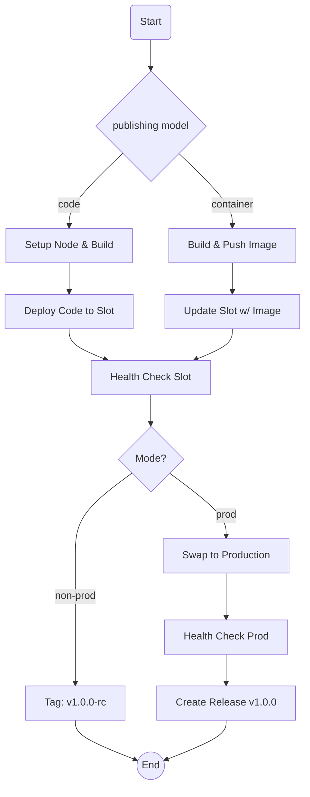

# Azure App Service CI/CD Action

An opinionated, dual-mode GitHub Action for deploying  applications to Azure App Service. It supports both **Code**  and **Container** publishing models, handling semantic versioning, slot deployments, health checks, and production swaps automatically.

## 🚀 Features

  * **Dual Modes:** `non-prod` for RC testing and `prod` for full release with slot swaps.
  * **Dual Models:** Deploy raw code (`npm install` + zip) or Docker containers.
  * **Automated Versioning:** Calculates semantic versions (SemVer) and manages GitHub Tags/Releases.
  * **Zero-Downtime:** Deploys to a staging slot, verifies health, and then swaps to production.
  * **Health Checks:** built-in verification of the deployed endpoint before swapping.

## workflow logic



## 📋 Usage

### Prerequisites

- You must have an Azure Service Principal JSON stored in your repository secrets (e.g., `AZURE_CREDENTIALS`).
- Service Principal should have the permission to deploy to the Azure App Service. See [Azure App Service Deployment Permissions](https://learn.microsoft.com/en-us/azure/app-service/deploy-github-actions?tabs=userlevel#permissions).
    ```json
    {
        "clientId": "your-client-id",
        "clientSecret": "your-client-secret",
        "subscriptionId": "your-subscription-id",
        "tenantId": "your-tenant-id"
    }
    ```

### 1\. Publishing Model: Code (Zip Deploy)

Best for standard Node.js apps. Builds, tests, and deploys the artifact.

```yaml
name: Deploy Node App
on: [push]

jobs:
  deploy:
    runs-on: ubuntu-latest
    steps:
      - name: Build & Deploy
        uses: mharikmert/az-app-service-build-and-deploy@v1
        with:
          mode: "prod"
          publishing_model: "code"
          
          # Azure Config
          azure_credentials: ${{ secrets.AZURE_CREDENTIALS }}
          resource_group: "my-resource-group"
          webapp_name: "my-node-app"
          slot_name: "staging"
          
          # Node Build Config
          node_version: "20.x"
          install_command: "npm ci"
          run_tests: "true"
          build_command: "npm run build"
          
          # Versioning
          github_token: ${{ secrets.GITHUB_TOKEN }}
          release: "true"
```

### 2\. Container Model (Docker)

Builds a Docker image, pushes to ACR, and updates the App Service.

```yaml
name: Deploy Container App
on: [push]

jobs:
  deploy:
    runs-on: ubuntu-latest
    steps:
      - uses: actions/checkout@v4
      
      - name: Build & Deploy
        uses: mharikmert/action-azure-node-deploy@v1
        with:
          mode: "prod"
          publishing_model: "container"
          
          # Container Registry Config
          container_registry: "myregistry.azurecr.io"
          container_repository: "my-api-service"
          container_registry_username: ${{ secrets.ACR_USERNAME }}
          container_registry_password: ${{ secrets.ACR_PASSWORD }}
          
          # Azure Config
          azure_credentials: ${{ secrets.AZURE_CREDENTIALS }}
          resource_group: "my-resource-group"
          webapp_name: "my-container-app"
          slot_name: "staging"
          
          # Versioning
          github_token: ${{ secrets.GITHUB_TOKEN }}
```

## ⚙️ Configuration

### Core Inputs

| Input               | Required | Default | Description                                                             |
| :------------------ | :------: | :------ | :---------------------------------------------------------------------- |
| `mode`              | **Yes**  | -       | `non-prod` (deploy to slot, no swap) or `prod` (deploy, swap, release). |
| `publishing_model`  |    No    | `code`  | `code` for zip deploy, `container` for Docker.                          |
| `github_token`      | **Yes**  | -       | Used for version calculation and creating releases.                     |
| `azure_credentials` | **Yes**  | -       | JSON credentials for `azure/login`.                                     |
| `resource_group`    | **Yes**  | -       | Azure Resource Group name.                                              |
| `webapp_name`       | **Yes**  | -       | Azure App Service name.                                                 |
| `slot_name`         | **Yes**  | -       | The slot to deploy to initially (e.g., `staging`, `dev`).               |

### Code Model Inputs

*Only used when `publishing_model` is `code`.*

| Input             | Default    | Description                                           |
| :---------------- | :--------- | :---------------------------------------------------- |
| `node_version`    | `22.x`     | Node.js version to setup.                             |
| `install_command` | `npm ci`   | Command to install dependencies.                      |
| `build_command`   | `""`       | Command to build the project (e.g., `npm run build`). |
| `run_tests`       | `false`    | If `true`, runs `test_command` before deployment.     |
| `test_command`    | `npm test` | Command to run tests.                                 |
| `package_path`    | `.`        | Path to the folder or zip to deploy.                  |

### Container Model Inputs

*Only used when `publishing_model` is `container`.*

| Input                         | Default        | Description                              |
| :---------------------------- | :------------- | :--------------------------------------- |
| `container_registry`          | `""`           | Registry URL (e.g., `myreg.azurecr.io`). |
| `container_repository`        | `""`           | Repository name (e.g., `my-app`).        |
| `container_registry_username` | `""`           | Username for registry login.             |
| `container_registry_password` | `""`           | Password/Token for registry login.       |
| `dockerfile`                  | `./Dockerfile` | Path to Dockerfile relative to root.     |

### Versioning & Strategy

| Input                | Default      | Description                                               |
| :------------------- | :----------- | :-------------------------------------------------------- |
| `swap_target_slot`   | `production` | The slot to swap into during `prod` mode.                 |
| `version_check_path` | `/`          | HTTP path to verify health (e.g. `/api/health`).          |
| `release`            | `false`      | If `true` (and mode is `prod`), creates a GitHub Release. |
| `prod_default_bump`  | `patch`      | SemVer bump type for production releases.                 |
| `non_prod_suffix`    | `-rc`        | Suffix appended to versions in `non-prod` mode.           |

## 📤 Outputs

| Output         | Description                                                                               |
| :------------- | :---------------------------------------------------------------------------------------- |
| `next_version` | The calculated semantic version (dry-run, e.g., `1.2.0`).                                 |
| `app_version`  | The actual version used for deployment (includes suffix in non-prod, e.g., `1.2.0-rc.1`). |
| `release_tag`  | The tag name created if a release occurred.                                               |

## 🏷️ Versioning Logic

1.  **Non-Prod Mode:**

      * Calculates next version based on commits.
      * Appends suffix (default `-rc`).
      * Deploys to `slot_name`.
      * **Result:** App is live on Staging slot with version `1.0.1-rc.1`. No Swap.

2.  **Prod Mode:**

      * Calculates next version.
      * Deploys to `slot_name`.
      * Performs Health Check.
      * Swaps `slot_name` with `swap_target_slot` (Production).
      * **Result:** App is live on Production with version `1.0.1`. GitHub Release created (optional).