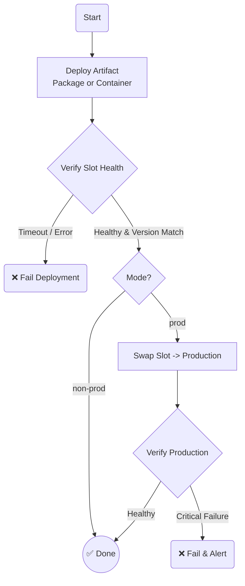

# 🛡️ Azure Web Apps Safe Deploy

A GitHub Action for Azure Web Apps that ensures deployment safety through health verification and zero-downtime slot swaps.

This action goes beyond standard deployments by implementing comprehensive health checks—handling cold starts, transient errors, and version verification—before releasing traffic to new deployments.

---

## 🚀 Why use this action over `azure/webapps-deploy`?

`azure/webapps-deploy` completes successfully once the package is published or the container is updated regardless of whether the application starts correctly. This action ensures the deployment is fully operational before marking the workflow as successful.

| Feature           | azure/webapps-deploy                                  | This Action                                                     |
| :---------------- | :---------------------------------------------------- | :-------------------------------------------------------------- |
| **Deployment**    | ✅ Publishes package / updates container configuration | ✅ Publishes package / updates container configuration           |
| **Verification**  | ❌ None or basic HTTP check                            | ✅ Polling with retry logic for cold starts and transient errors |
| **Version Check** | ❌ May serve cached content                            | ✅ Confirms the expected version is actively serving traffic     |
| **Swap Safety**   | ⚠️ Swaps without verification                          | ✅ Validates both staging and production endpoints after swap    |

---

## 🧠 Workflow Logic



---

## 📋 Prerequisites

- **Azure CLI Authentication**: Use `azure/login` before this action
- **Service Principal**: Must have required permissions to the target App Service. See [Azure App Service Deployment Permissions](https://learn.microsoft.com/en-us/azure/app-service/deploy-github-actions?tabs=userlevel#permissions).
- **Deployment Slot**: A configured slot on the target Web App (e.g., `staging`, `test`)

---

## ⚡ Usage Examples

### Package (Code) Deployment

```yaml
jobs:
  build:
    runs-on: ubuntu-latest
    steps:
      - uses: actions/checkout@v4
      - name: Build Application
        run: | # Assume your configuration creates a 'dist' folder for the production build
          npm ci --include=dev
          npm run build 
          npm prune --production
          
      - name: Upload Artifact
        uses: actions/upload-artifact@v4
        with:
          name: package
          path: dist  
          retention-days: 1

  deploy:
    needs: build
    runs-on: ubuntu-latest
    steps:
      - uses: actions/checkout@v4
      
      - name: Download Artifact
        uses: actions/download-artifact@v4
        with:
          name: package
          path: dist 

      - uses: azure/login@v1
        with:
          creds: ${{ secrets.AZURE_CREDENTIALS }}

      - name: Deploy to Staging
        uses: mharikmert/az-webapp-safe-deploy@v2
        with:
          mode: "non-prod"
          app_name: "my-backend-api"
          resource_group: "my-rg"
          slot_name: "staging"
          package_path: "dist" 
          health_check_path: "/health"
          expected_version: ${{ github.sha }}

```

### Container Deployment

```yaml
jobs:
  build:
    runs-on: ubuntu-latest
    steps:
      - uses: docker/login-action@v3
        with:
          registry: myregistry.azurecr.io
          username: ${{ secrets.ACR_USERNAME }}
          password: ${{ secrets.ACR_PASSWORD }}
      
      - uses: docker/build-push-action@v5
        with:
          push: true
          tags: myregistry.azurecr.io/myapp:${{ github.sha }}

  deploy:
    needs: build
    runs-on: ubuntu-latest
    steps:
      - uses: azure/login@v1
        with:
          creds: ${{ secrets.AZURE_CREDENTIALS }}

      - name: Deploy to Staging & Swap to Production
        uses: mharikmert/az-webapp-safe-deploy@v2
        with:
          mode: "prod"
          # Identity
          app_name: "my-container-app"
          resource_group: "my-rg"
          slot_name: "staging" # Initial deployment slot
          swap_target: "production" # Target slot for swap operation
          # Artifact
          images: "myregistry.azurecr.io/myapp:${{ github.sha }}"
          # Verification
          health_check_path: "/health"
          expected_version: ${{ github.sha }} # Expected version
```

---

## ⚙️ Inputs

### Core Configuration

| Input            | Required | Description                                                                                   |
| :--------------- | :------- | :-------------------------------------------------------------------------------------------- |
| `app_name`       | Yes      | Name of the Azure Web App                                                                     |
| `resource_group` | Yes      | Azure Resource Group name                                                                     |
| `slot_name`      | Yes      | Target deployment slot (e.g., `staging`, `test`)                                              |
| `mode`           | No       | `non-prod` (deploy + verify) or `prod` (deploy + verify + swap + verify). Default: `non-prod` |

### Artifact Configuration

Provide one of the following:

| Input          | Description                                                    |
| :------------- | :------------------------------------------------------------- |
| `package_path` | Path to deployment package (`.zip`) for code deployments       |
| `images`       | Container image tag (e.g., `myregistry.azurecr.io/app:v1.0.0`) |

### Health Verification

| Input               | Default      | Description                                                               |
| :------------------ | :----------- | :------------------------------------------------------------------------ |
| `health_check_path` | `/`          | HTTP endpoint for health verification                                     |
| `expected_version`  | -            | Version string to match in response body (ensures new deployment is live) |
| `swap_target`       | `production` | Target slot for swap operation (prod mode only)                           |

---

## 🔍 Health Verification Details

The action implements a polling mechanism with a 5-minute timeout:

**Request Handling**
- 20-second timeout per request to accommodate cold starts
- 5-second interval between retry attempts
- Automatic retry on connection refused, timeouts, and 502/503 responses

**Version Matching**
- Checks JSON response fields: `version`, `app_version`
- Falls back to substring search in response body
- Blocks slot swap until the expected version is confirmed

---

## ⚠️ Troubleshooting

**Health Check Timed Out**
- Verify the health endpoint returns HTTP 200
- Ensure application startup completes within 5 minutes
- Confirm the correct slot name is specified

**Operation Canceled**
- Check if the GitHub workflow timeout was exceeded
- Review Azure Activity Log for slot restart issues

**Azure CLI Failed**
- Verify the service principal has Contributor role on the resource group
- Ensure `azure/login` completed successfully before this action

---

## 🧪 Tests [](https://coveralls.io/github/mharikmert/az-webapp-safe-deploy?branch=master)


```bash
npm install
npm test                 # Run all tests
npm test -- --coverage   # With coverage report
```
